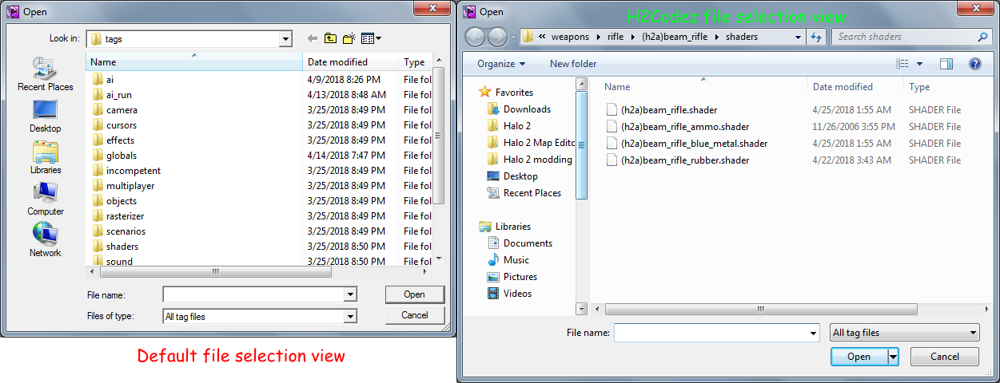

title:      Misc H2Guerilla Changes
desc:       Changes that seem important enough to mention but not important enough for their own file.
template:   document
nav:        H2Guerilla>Misc
percent:    100
date:       2018/12/07
authors:    General_101

## Advanced Shader View
When clicking on the edit button in the toolbar you will see a new option labeled "Advanced Shader View". By default you will see the default shader template system that lets you input bitmaps into named boxes.
If you click on advanced shader view and open the shader again you will see the layout has changed allowing you to see compiled shader data if it was extracted. This can be useful for attempting to rebuild extracted shaders.
 
## New Instance
When clicking file in H2Guerilla a new option will appear labeled "New Instance". This just simply opens a second instance of H2Guerilla.
 
## Unlocked Tags
By default H2Guerilla can only view and create a few tags. Things like shaders and bitmaps. Even then fields in the tags you can view are hidden leaving you with a very limited tool.
H2Codez allows us to open and see all the tags Halo 2 accepts.
 
## Xbox Audio Codec

https://mega.nz/#!kl8HFCYQ!8SJbn89GCCHZcVqMaT4GQRbUW7t2hnswHO7d1xf1E_E

Placing this file in the bin folder allows H2Guerilla you to preview sounds from the sound tag.
It can also be used as your primary audio codec to compile sound tags in Halo CE which can then be edited in H1Guerilla and transferred over just fine to Halo 2.
You can also use it to convert audio files extracted from the cache with tools like Gravemind into playable audio files.
 
## HS_doc
While the command still exists, it has been added as an option you can click in the menus to generate it.
It will give you the needed scripting documentation for Halo 2. It has also been modified to output globals script functions.
 
## File Selection Menu
The menu has been changed so that Windows versions below seven can get easy access to the favorites tab and such from the file selection menu in H2Guerilla and H2Sapien.

Image to see difference clearly.
 
## Multi Tag
If you hold down ALT while opening a tag from the hierarchy menu you will be greeted by simplified menu that will work for most tags. Multiple tags can be opened in the same window using this key combination. Double clicking on
row colored blue will allow you to reveal more information about that section for editing.
 
## Sound Editing
Sound tags imported from CE can be used in H2EK by compiling them in H1tool with the XBADPCM codec. Editing them in H2Guerilla would normally result in a crash however this should be solved as of the latest H2Codez update.
Issue was a crash caused by a template in the sound effect block that would be solved by disabling template view.