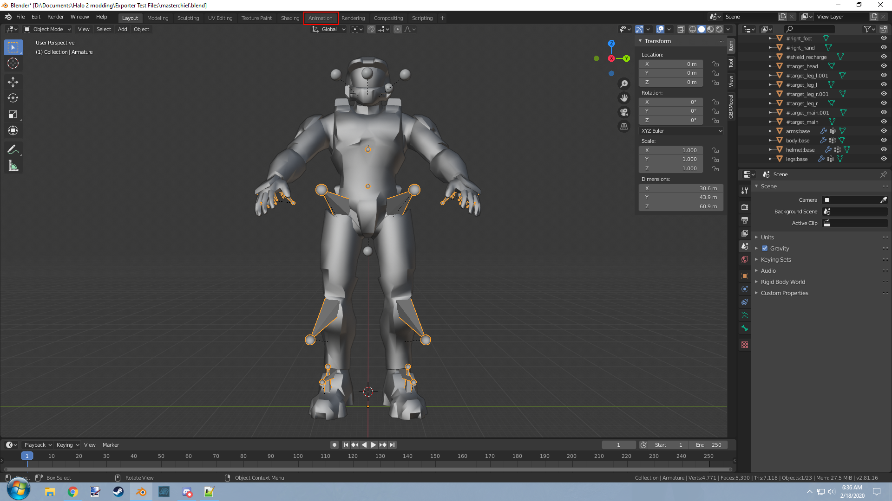
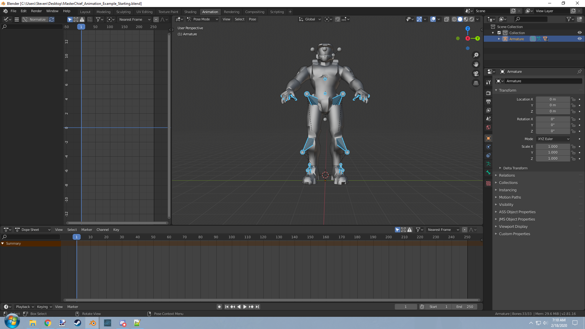
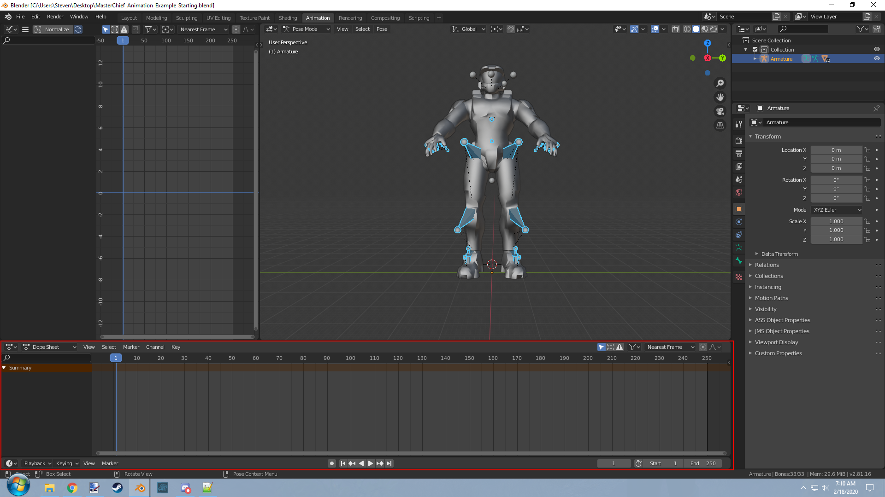
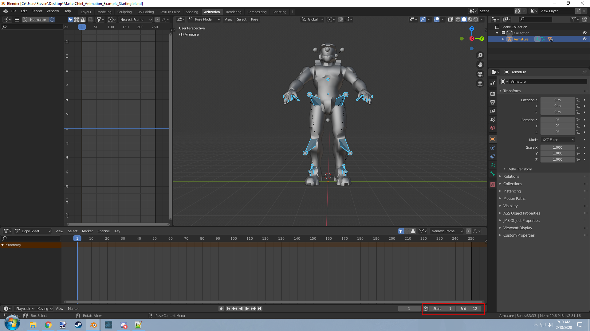
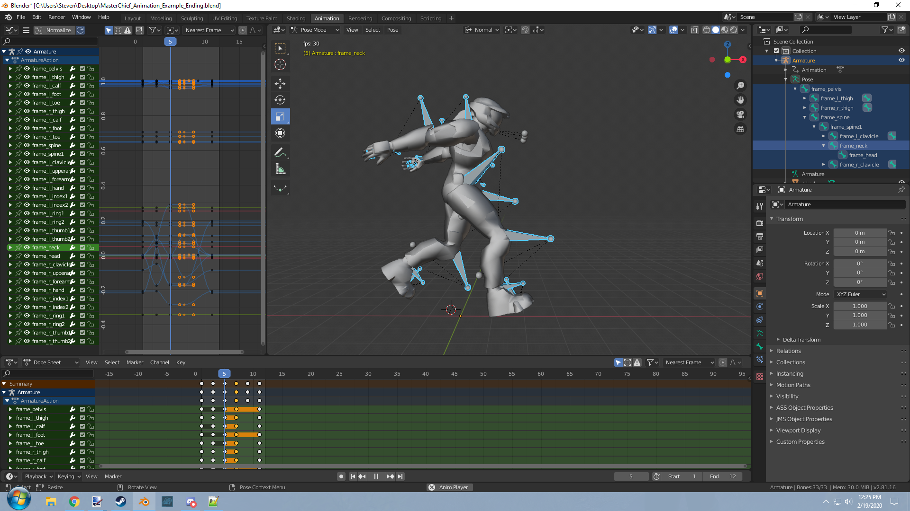

title:      Model Animation Graphs JMA
desc:       Making model_animation_graphs tags through JMA files.
template:   document
nav:        H2Tool>Animations>Animation Importing 
percent:    100
date:       2020/02/19
authors:    General_101

[Halo Export Scripts](http://www.h2maps.net/Tools/PC/Export%20Scripts/Halo_Export.7z) -> Export scripts for your 3D modeling software of choice.

[Blender Program](https://www.blender.org/) -> The Blender modeling program itself.

[Spartan Model](http://www.h2maps.net/Sources/H2EK%20Source/Manual/Animations/MasterChief_Animation_Example_Starting.blend) -> A rigged Master Chief model for posing.

[End Result](http://www.h2maps.net/Sources/H2EK%20Source/Manual/Animations/MasterChief_Animation_Example_Ending.blend) -> The end result of this guide for you to compare.

Animations are one of the most important parts of any game. In this guide I will attempt to explain to you how to import animations as best as I can. Let me state that this guide will not cover how to work with 3DS Max software. 
If you want to use 3DS Max instead of Blender then look up animation importing guides for CE instead as it is basically the same thing.

We will start by setting up our working environment. Click on the Halo Export Scripts link above and extract the contents of the zip. If you navigate over to "Halo Export\Halo 2\Animation" and you will find a .py file named
Blend2Halo2-Animation. This file will be our exporter for Blender. Go to Blender and navigate to "Edit" on the top left and on the bottom of that dropdown menu click on "Preferences". A menu with tabs for various settings should
appear. Ensure you are on the "Add-ons" tab and look for a button labeled "Install" on the top right. Click this button and using the file browser menu, navigate on over to your Blend2Halo2-Animation.py file and select it to install.
Once installed find "Blend2Halo2 Animation" in the add-on list. You can make this quicker by changing the category from "All" to "Import-Export". Once checked you should notice that when you go to to "File" tab in the top left
and look for a button labeled "Export". Inside should be another option labeled Halo Animation (.jma). If you see this then you can continue on to the part you're actually here for.

Now go ahead and download the spartan model if you haven't already. It shall be your starting point for our animation. Our goal right now will be to make an animation for the spartan biped, add it to the model_animation_graph tag,
and play it ingame to see the results. You will notice when opening the file that it looks standard for Blender however it would help us if we changed the workspace to something more relevant. Navigate to the top and notice the
button labeled "animation" as shown in the following image. 

Click on it and your workspace should look something more like this now.

Now that we have our workspace we can go over animations. For your understanding, animations are certain frames where specific location, rotation, and scale values are set. Those values are interpolated from frame to frame to 
present you with the idea of movement. With the armature selected and your object mode set to "Pose Mode" you can select a bone. Pressing the "T" key on your keyboard while having your cursor over the scene window will bring up
the tools window. With a bone selected in pose mode you can then go to the tools menu and select an action. Whether that be moving it on the xyz with the "Move" icon represented by the 4 arrows, rotating the bone with the rotate
tool represented by the circular shape made of two arrows going in opposite directions, or with the scale tool represented by the two boxes and arrow to represent a change in size. Another concept you will have to be familiar with 
is the dope sheet below as seen in the following picture.

This is where you can see what objects have animation data at what frame. Their order from top to bottom being the object and the order left to right being the frame number. Making an animation means taking your objects, positing
them how you want them to look, and setting that for the current frame while moving on to the next.

So lets take set our starting position for the animation. Begin by going down to your frame start and end values to match how many frames you want your animation to go for. Lets do 1 for start and 12 for end as seen below.

How long your timeline is will determine how fast or slow your animation will play ingame. Think about how you want your animation to look while choosing these values. You can always come back and change it later if you need more 
frames. Using the left or right arrow on your keyboard, go to your first frame in the timeline. In our case it will be frame one. Now select your Armature and set object mode to "Pose Mode" then hit the "A" key to select all bones. 
Press the "I" key to bring up the "Insert Keyframe" menu and from here go ahead and do location, rotation, and scale for frame 0. Move on to another frame and mess with the location, rotation, and scale of specific bones to achieve 
the movement you want. You can press "Spacebar" to play the current animation in your scene and see how it is coming together. After you have set a few keyframes you should have something that looks like the image below. 

If you need to change the position of a keyframe you can go down to the dope sheet and select it so that it goes from white to orange. You can the press the "G" key on your keyboard in order to move it to a different frame.
If you have gotten this far then you likely have an animation that is ready to export. All you need to do at this point is go to "File" and select "Export" and select "Halo Animation File (.jma)". From here an export menu will show 
up with a couple of options.

#####Encoding

This option will let you change the encoding Halo CE by default takes UTF-8 files and Halo 2 Vista takes UTF-16LE. H2Codez however can read the file properly no matter the file encoding so you do not need to mess with this.

#####Extension

This will let you change the extension of the file for importing animations for different uses. Refer to the extension description above for more info on this. 

#####Version

This will change the file version of the exported JMA. 16390-16392 are the maximum for CE though only 16392 is functional for import in Tool.exe. Halo 2 Vista can take 16390-16395 and only 16392-16395 is functional for import in 
H2Tool.exe. 16395 is the last version made and has support for biped controller data from 3DS Max but the Blender exporter does not currently support this feature. You do not need to mess with this and can leave it at default 
which is 16392.

#####Custom Framerate

The framerate of the scene can be written to the JMA file though by default we always write 30. By checking this option we will instead read the selected framerate the scene has set and write that. You can find the framerate option 
in the Output Properties tab under the dimensions box as seen in the following image.

#####Biped Controller

Purely for testing purposes. Please do not enable unless you are looking into this as well. Version will have to be 16395 for this to actually do anything to the file.

Once you have saved the animation file you can take this to H2Tool to be imported. Created the standard folder structure like you would for a collisions or physics file but instead call this folder "animations". Place your 
animation file inside of that folder and use the H2CodezLauncher to import it.

Now comes the important part of this procedure. The command imports animations but it isn't complete. It doesn't actually create the tag for the animation or create the needed skeleton. You will have to create both of these.
Go to H2Guerilla and create a new model_animation_graph tag. In the private flags box check both "imported with codec compressors" and "animation data reordered". From there you begin to add as many nodes as your skeleton has.
You make this easier by exporting your skeleton for importing with a simple collision model and copying the skeleton from the collision over to the animation graph. Now for every node check the flag "primary model" and for the
root node check the flag "local root". You will also have to make the modes tag block by hand as well. Compare to existing animations to see how this should work. Once you have done the skeleton you should be ready to import 
animations for your model.
