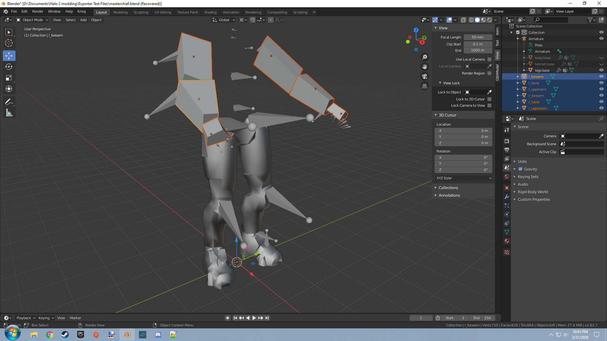
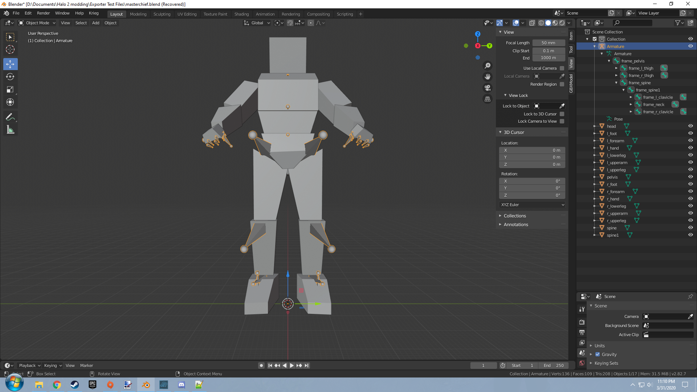
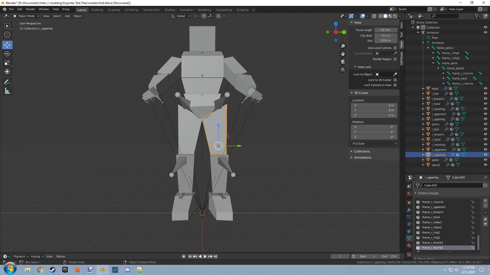
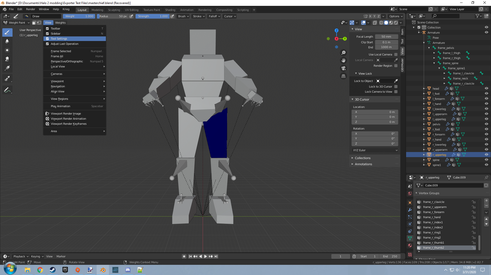
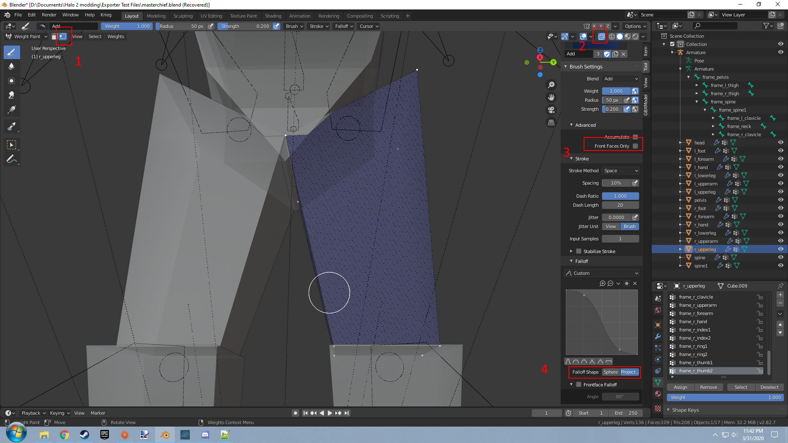

title:      Collision Tags
desc:       Preparing JMS files for importing with H2Tool to create working collision_model tags.
template:   document
nav:        H2Tool>Collision Model>Collision Blender
percent:    100
date:       2020/2/04
authors:    General_101

[Halo Export Scripts](http://www.h2maps.net/Tools/PC/Export%20Scripts/Halo_Export.7z) -> Export scripts for your 3D modeling software of choice.

[Blender Program](https://www.blender.org/) -> The Blender modeling program itself.

Know that only collisions for models you make in either the DAEConverter or the BSP conversion method will import properly. Making collisions for the original chief model for example will result in wonky results without the 
original skeleton. Yes, I realize the that this makes showcasing a Masterchief model as an example a bit strange.
{: .warning}

Collision tags in Halo 2 are created by exporting JMS files in UTF-16 format. We can then import the JMS file with H2Tool to get our working collision_model tags.

Start by installing the io_scene_jms script bundle found in the Halo_Export.7z archive to be able to export valid JMS files for Halo 2. This script should do what you need for rigged meshes.

Once you have the script installed you should have an option to export a JMS file from the export menu in Blender. We can begin by creating our skeleton for the model. Our skeleton can be made of one of two things. A set of
objects parented to one another. The nodes in the set of objects must contain "frame" or "b_" in their object names in order to be recognized as proper nodes. This is not true for an armature and they do not require any special
names to function as nodes. The armature system separates them well enough to let the exporter know they are distinct objects. In this example we will be using the Masterchief skeleton provided above as an example. We will be
recreating the collision mesh for the Masterchief biped to give you an idea of how everything works.

This is the part where you have to get a bit imaginative. Lets take a simple concept like an arm and try to simplify the it. An arm can typically be cut up into three sections. The upper arm, the lower arm, and the hand. This
is the simplest representation of an arm and how the original Masterchief skeleton sets up collisions for the arms. Start by adding some cubes and morph them to fit the areas you need like so.

Now that you have your left arm setup you can create another set of meshes for the right arm or you can use the mirror modifier on a duplicated set of left arm meshes to get a set for the right arm if you have a bilateral mesh.
Make sure to apply any scale and rotation on your meshes before you use the mirror modifier and when you do use it ensure you mirror it on the right axis. Go ahead and create the meshes for the rest of the biped now. 
Create a mesh only for the bones you feel need it and represents the full range of motion that area can make so that the collision isn't awkward. In the end you should have something that looks like this.

Lets now begin to tie these meshes to a bone so that it is exported properly. Start by selecting all your objects and then select your armature last. Hit CTRL + P to run "Set Parent to" and select "With Empty Groups" under 
"Armature Deform". Once that is done select the object and select object data properties. You should see the full list of bones the model has in the armature like in the image below.

Now go ahead and switch from object mode to weight paint. Go to the view tab found next our mode option and enable tool settings like seen below. You might want to make your weight brush "Mix" while you're here.

Lets enable some options to make weight painting easier. We don't require precision in the case of collision models. We just need to tie the entire mesh to a bone so lets change settings to be able to paint through geometry to 
make the process quicker.

1. Start by enabling vertex selection. This will make it so only highlighted vertices will be valid for painting. You can press a in your scene after enabling this to select all vertices for that object.

2. Make all objects in your scene transparent. This will let you see the highlighted points in your mesh. The setting for how opaque an object is can be found in the xray setting.

3. Disable this front faces only option to paint through geometry that way you don't have to move the camera around to get objects in the back.

4. Change falloff shape to projection. You won't be able to paint through geo without this as well.

Once you have all this set up choose the proper vertex group in the object data list and then begin painting over your model until it is completely red. Only use one vertex group per object as collisions can't be skinned meshes. 
In the case of the r_upperleg object we have selected we want to select the vertex group "frame_r_thigh". Go ahead and paint your weights now. 

Once this is done you should now give your objects materials. The material names should be one of the material names listed in shader templates or have a global material name override if nothing that exists is defined. Lets use 
a material named head for our players head and a material named body for the body. This way we split them up in a way that makes it easy for us to define what area counts as headshot damage. Set up your regions and permutations
in the JMS Object Properties dropdown. Use the same set of regions and permutation that the render_model you are importing a collision for has.

From here you can export the model from the export menu to get the JMS you need. Select JMS version 8210 and game version Halo 2 if you are exporting for Halo 2.

Place the JMS file inside a folder labeled "collision" and browse the the parent folder that you created the collision folder in using the launcher. Hit compile while having collisions checked.

One last thing to note about collision importing. Any markers defined in the JMS will be imported as pathfinding spheres. If you need those in those collisions it is as easy as adding a UV sphere to your scene and labeling it 
as a marker with the # affix.
