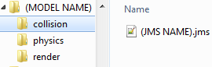

title:      Object Tags
desc:       Using the object or all checkbox in the launcher to make different types of tags.
template:   document
nav:        H2Tool>Object Tags
percent:    100
date:       2018/12/07
authors:    General_101

The object checkbox will create a tag type that you choose from the dropdown if an ASS/JMS file for the render exists. The object will take the name for the object from the parent folder. Below I will show you how to use the all option properly

Now that you have all of your JMS/ASS files ready you will want to setup your folder structure in the data folder of the map editor. The root folder can be anywhere but but sure that it follows the following folder structure.
Words in quotations are the name of the folder.
 

        
You can now use the all option in the model compile tab. Just select the object type and browse and select the models root folder. It will then spit out the compiled tags as it was in data but in tags in terms of folder location.
Keep in mind that the collision command is a bit strange. While all your other tags will be inside the directory where they were compiled the collision tag will be placed outside the root folder.
Just move it back inside afterwards and it will be fine.