title:      Physics Tags
desc:       Preparing JMS files for importing with H2Tool to create working physics_model tags.
template:   document
nav:        H2Tool>Physics Model>Physics Blender
percent:    100
date:       2020/2/04
authors:    General_101

[Halo Export Scripts](http://www.h2maps.net/Tools/PC/Export%20Scripts/Halo_Export.7z) -> Export scripts for your 3D modeling software of choice.

[Blender Program](https://www.blender.org/) -> The Blender modeling program itself.

[Hinge End Example](http://www.h2maps.net/Sources/H2EK%20Source/Manual/Physics/Hinge%20Example%202.8%20Blender.blend) -> The Blender modeling program itself.

The JMS exporter for Blender has some physics functionality. It's a work in progress and we are working in Blender instead of the original 3DS Max tools so things may get a bit awkward here in order to make this fit in our
toolset. After you have installed the exporter in your Blender install then you should notice a new dropdown found in the object properties panel.

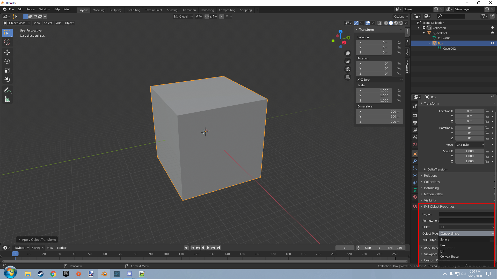

As you can see in the image above. From here you can select several object types so that the exporter knows how to handle your mesh as it outputs the data for it to the JMS file on export. The list below will explain the 
primitive types. All physics objects require the '$' symbol in order to be processed as physics objects.

## Sphere
Spheres are a uniform scale object that is defined by the radius of the sphere. Uniform here being used to describe the scale being the same on all axis. The exporter however only uses the X axis to do the math it needs to do.

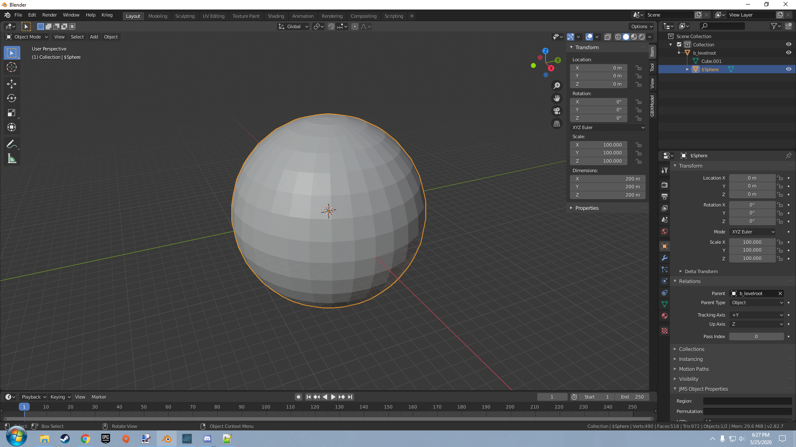

## Box
Box objects are cube shaped objects that use extends to define the dimensions of the cube. This means that the dimensions of the cube gets it's values from the center out like a radius. The xyz axis is considered here for the
dimensions of the cube.

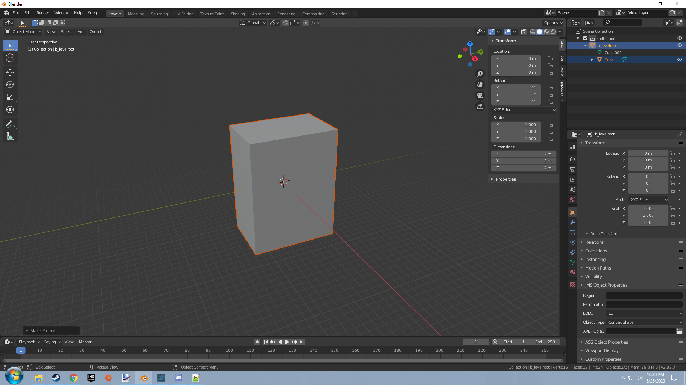

## Capsules
Capsule objects are represented by cylinder objects in Blender. The full height of the object is taken from the Z axis and the radius is taken from the x. The X and Y axis should be uniform to get the best representation of the
object on how it would look ingame. The height of the capsule can't be less than the radius.

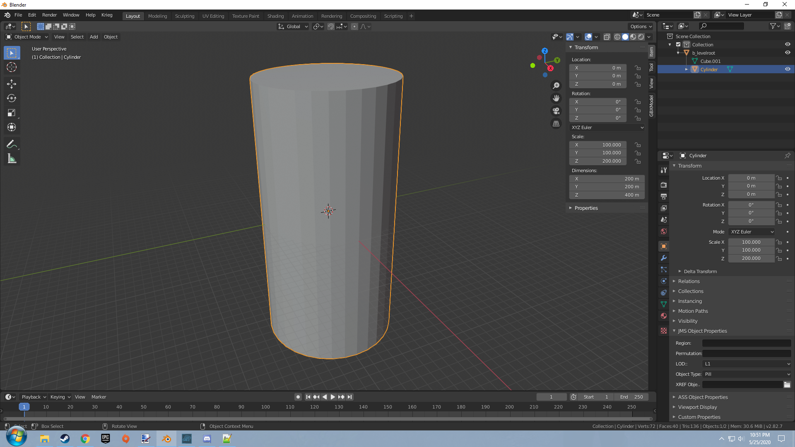

## Convex
Convex objects take the vertices of the object to create a sort of bounding radius around the object you are generating. These objects have to be convex. Below we will give an example of a non convex object.

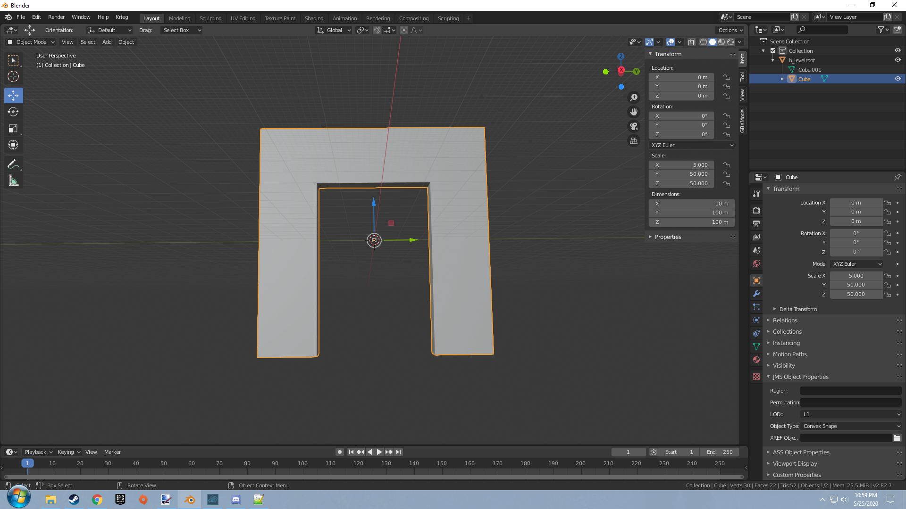

An object like this wouldn't allow you to pass through the empty section in this door frame. It would effectively be as if you had imported an object that looks like this.

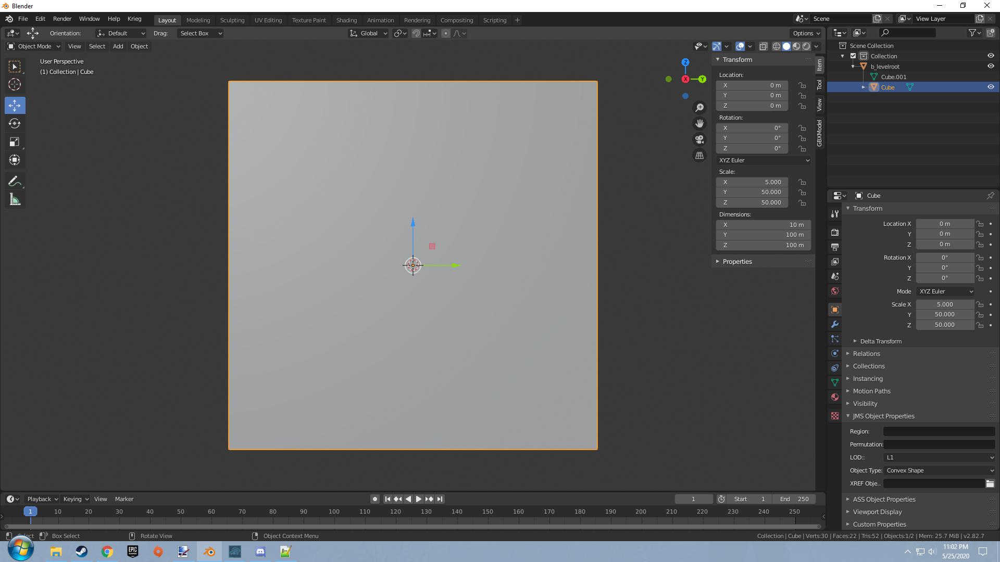

Let's fix that by changing our mesh and having it be made up of separate convex mesh pieces. Such as how it is done below.

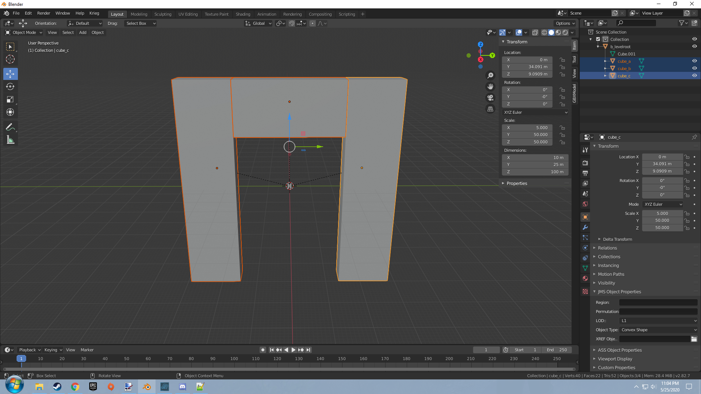

## Hinge
Hinges in Blender are a bit more work. hinges can be used with either an objects or bones as parent though it will work better with an armature. Lets practice hinges by making a simple hatch like in Halo 3's Highground. Add 
two cubes for the hatch and for the frame our hatch is going to hang on to. Also add an empty arrows object from the mesh menu to be the hinge point. Position the objects in your scene so that it looks something like this.

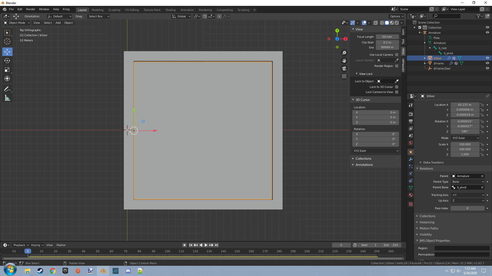

Lets go over the objects we added to our scene here.

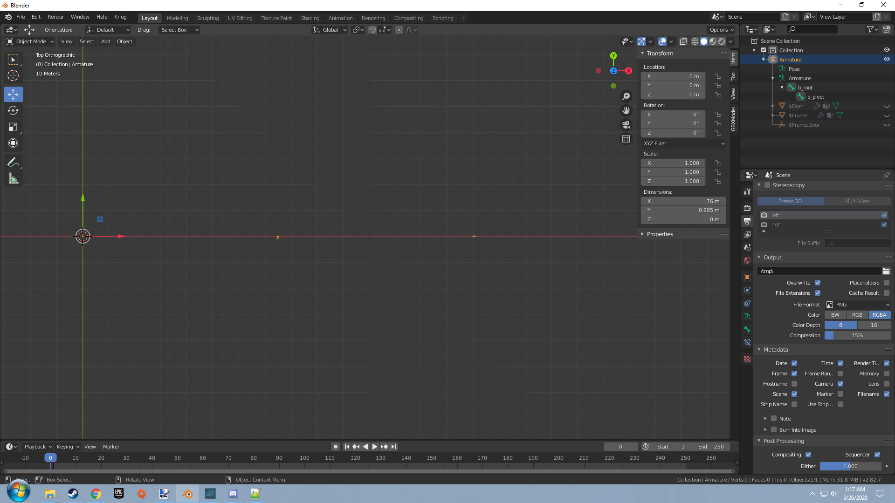

The armature. This object contains our bones that our objects will pivot around ingame. 

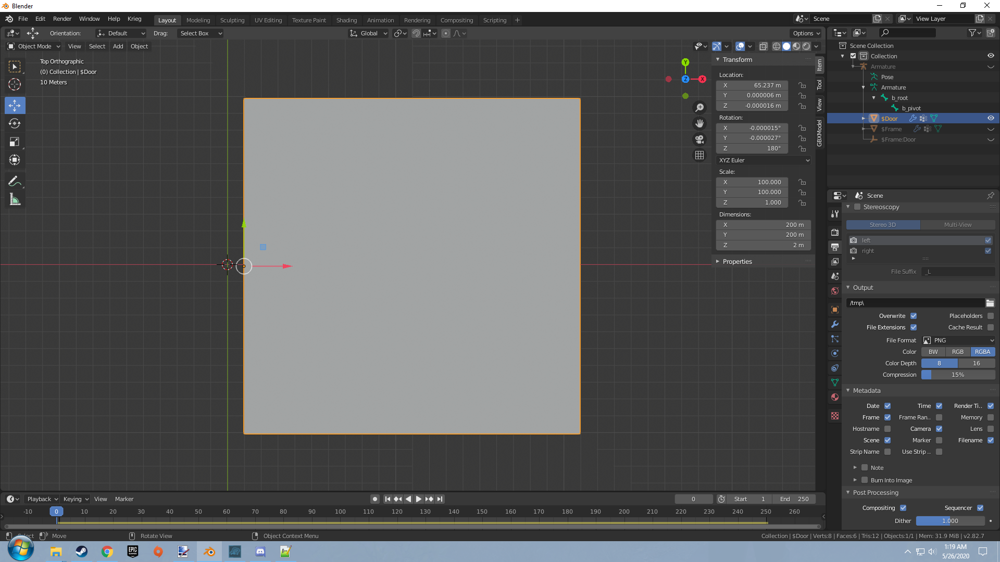

The cube we edited to be our door. This door is set to use the b_pivot node as the parent for this object which will be used as the pivot point ingame.

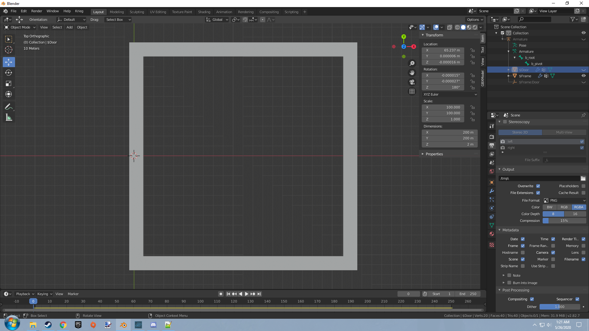

The second cube we edited to be the frame for our door. This object will serve and an anchor point for the door by having the parent of b_root.

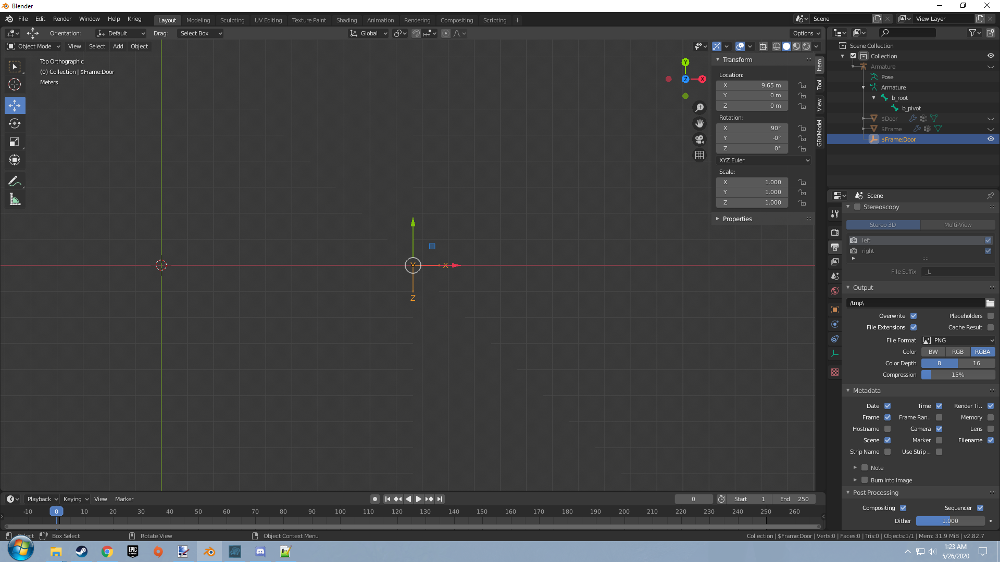

The empty arrows object that we added to serve as the hinge connection in the Blender physics engine.

These are the pieces that will serve us to complete our hinge door setup. Let's go over the specific settings needed to set up a hinge constraint. Start by selecting the door object and giving it a rigid body as seen here.

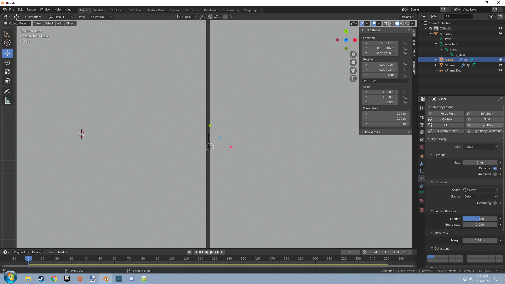

No specific changes are needed here. Lets now go over to the frame object we created and set up the same over there.

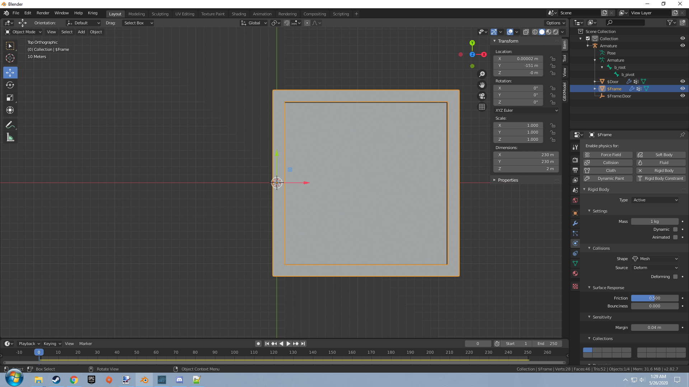

This time however you will uncheck the dynamic flag in the rigid body settings as you want this rigid body to remain still during physics simulation.

Now lets add a rigid body constraint to the empty arrows object we have here. There are a few settings we should mess with here.

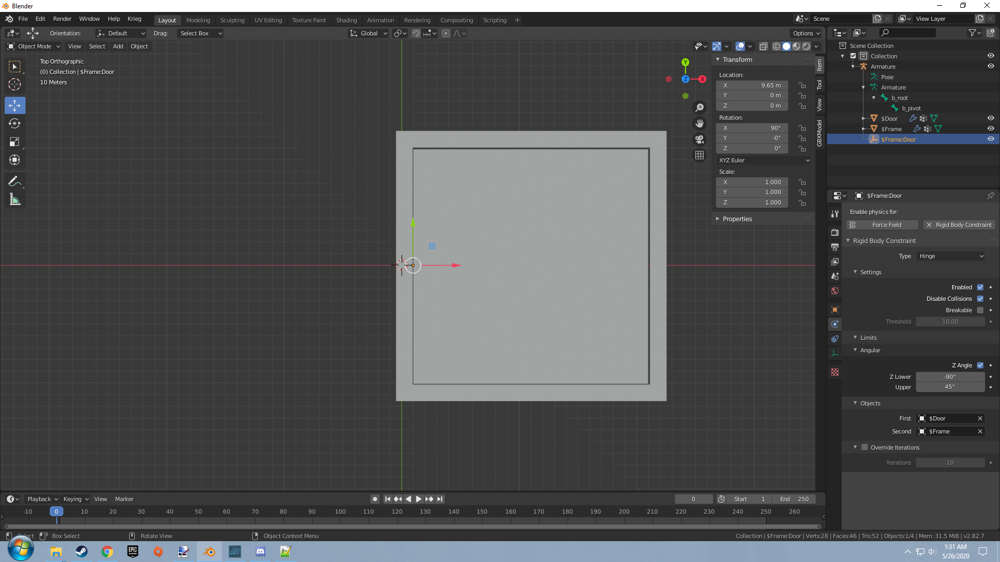

After adding the constraint make sure to switch the constraint type from Fixed to Hinge. Once that is done you should notice a few new options appear in your properties panel. Under the objects dropdown be sure to select the 
two objects you are using in your hinge constraint. The first being the physics object in motion and the second being the anchor point our hinge will use for the physics object. So the first will be set to the Door object and
the second will be set to frame as seen in the image above.

The next thing you should look at should be the angular dropdown. This is the area where you can set how many degrees your physics object can move in each direction. This is important so don't forget this. Enable the Z angle 
flag and set the Z lower and upper values to the proper degrees for this object.

The final value you can set is a friction value in the anchor object. Under the dynamics dropdown for the anchor object you can change the value for damping translation to make the object move with less or more resistance.

## Final Notes
Other physics types in the JMS file are currently not supported. May come in the future.

Keep in mind that the node index definition in the JMS for physics object use what the parent of the object is set to and in the case of the armature then the bone that is set to be the parent. This is especially important for 
hinges as this is how it gets the nodes it needs for the hinge definition in the JMS.
