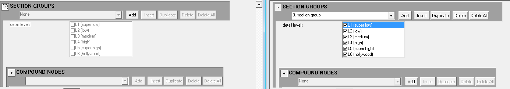

title:      Render Model BSP
desc:       Making render_model tags through converted BSP geometry.
template:   document
nav:        H2Tool>Render Model>BSP Conversion
percent:    100
date:       2018/12/07
authors:    General_101

# Links
[Example files](https://mega.nz/#!BpFzHaQQ!zj1lH0FhUk83_6OarKwuTy5ueijLzD2mtFFM3AnOGAY) for the render model importing.

In order to import a working render model one must first export a valid ASS file. You will want to assign your shaders for the model somewhere in the shader_collection so that they are assigned to the BSP during compile.
This will help you later. A good method to prevent out of BSP errors is to surround your model in a box and give it a unique shader with the @ flag at the end of the shader name. 
This will expand the space for the model as collision only meaning no render geometry is added to your render model. Give the rest of the model the ! flag at the end of the material name so that it only generates render geometry 
and nothing else. This will help with errors related to collisions and such. This won't solve everything due to the methods but this will help with most of your issues. 

You are now ready to use the render command. Hit the browse button and select the ASS file in your render folder. Select render in the model type and make sure the dropdown is on BSP.
Once it is compiled you will need to now fix the result as it is not ready to be used. All this method does is transfer geometry data over. The rest must be filled in by you.
We will go over how to get it usable in Halo 2 now. Please download the render example pack so that you may follow along as I explain. Let's first begin from the bottom of the render model file starting with the materials block. 

Compare this with the materials block in the original BSP file that should have been placed in the same folder.

You can look at the image above to see where we are. Left being the render model and right being the original BSP. You will want to transfer over the materials in the exact same order. Do this until you are done and we can move on
to the next part of the model.

Here you will setup your model origin. Left is what an freshly imported render model looks like and left is what we want it to look like to work. You will want to add a node and then give it a name. Fill in the values with the
ones that are shown in the image. Not doing this can result in the model not appearing ingame.

Next you will want to fill in section groups and invalid section pair bits. For invalid section pair bits just hit the add button once and you are done. For section groups just click the add button once and check all the boxes.

Next you will want to add a node map. Keep in mind that each section will have its own node map. Just copy the node map you make to the other sections. Just click add a single time and it should be good. Add more node maps and 
increase the value by 1 for each node you have in the node list.

Now for the part about.... parts. Left being a fresh copy, middle being a modified copy, and right being the original BSP. You will want to go into parts and check override triangle list. You will also see here that the first
material you added will be assigned to all the parts. You can compare this to your BSP file to see what part had what assigned. This should be the same across the files. Keep in mind that there could be multiple parts in a model
and each section has its own parts.

Next you will want to change the geometry classification in section to rigid. You will want to do this to all sections you may have.

Now you will want to add a region and a permutation. If you want multiple permutations you can change the section index to the represent the permutation you want. The first section you see being index 0 and the second in the list
being index 1.

Now name your render model. You should be done after this. 

Now you may have read this and now be wondering how multiple sections for permutations work. It's pretty simple.

Simply place multiple ASS files in the same directory and they will be added as new sections. The order they are in alphabetically will determine the section order. From here simply reference the proper index in the permutation 
section.