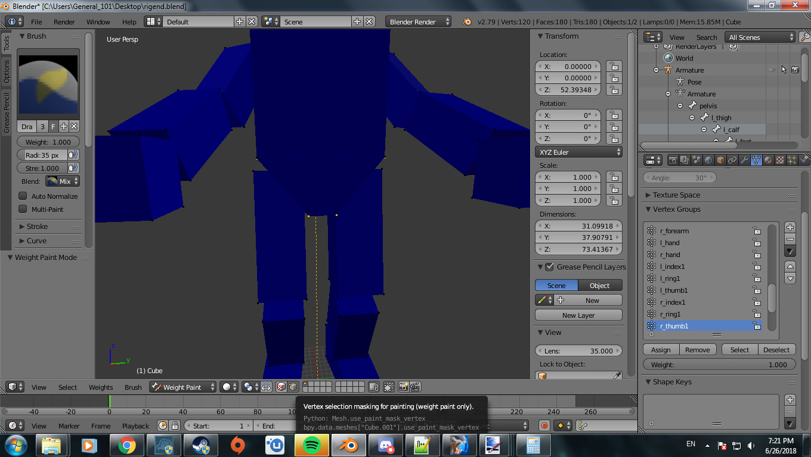

title:      Render Model DAE
desc:       Making render_model tags through converted DAE files.
template:   document
nav:        H2Tool>Render Model>DAE Conversion
percent:    100
date:       2018/12/07
authors:    General_101

In this guide we will go over exporting the needed skeleton from Adjutant, setting up our mesh to be accepted, doing the weights for our mesh, and the final steps in generating a working render model. 

# Links

[Adjutant](http://forum.halomaps.org/index.cfm?page=topic&topicID=45590)

An asset extractor for various Halo games. This is the program we will be using to extract skeletons from the Halo 2 Xbox(H2X) version of the game. There is no program that can do this for Halo 2 Vista(H2V) so this is how we need to go about it. 
Just scroll down the page to find that tinyurl link that should take you to a Mega download.

[Halo Maps Files](https://haloce3.com/xmf/)

A link to various map files from various Halo Games. Keep in mind you will need to at least have all the resource maps for Halo 2 to extract things properly. This includes shared.map, single_player_shared.map, and mainmenu.map. 
I would recommend downloading every Halo 2 map and placing them all in the same folder for complete access to the Halo 2 assets available to us.

[DAE Converter](https://github.com/Project-Cartographer/DaeConverter)

The source code of the program we are using to build our models.

[Blender](https://www.blender.org/)

The modeling program we will be using in this tutorial. Also the only one that will work for sure with our DAE converter. 3DS Max has not been tested cause 3DS Max is for uncool and unloved kids.

[Example Model](https://mega.nz/#!kgFGnQpZ!ctIqEpuoUttfArvCH1JXGDzkafk6FxOHWCu5YuGfi1Y)

Our example model for beginners. We will use this to hopefully show you the way around the program

[End Result of Example Model](https://mega.nz/#!F8VSAQBa!XN0OQsEKcZT5y7bJYI-sM2Vjs71g_nIxGOB1OA7rlak)

Our example model that we made except finished if you do not understand a part and need a visual representation.

[End Result of Example Armature](https://mega.nz/#!wotgVSRA!fJLFRf0egCoHRCcMtvyAWw88IsqQwgbq5CyoqMgiB3o)

The armature we will need for our skeleton. When you make armatures for different skeletons follow this setup

[H2V Tag Extractor](https://halo2.online/threads/tag-extractor-for-magical-doctor-wizard-researchers-only.2076/#post-10618)

A useful tool for extracting tags from H2V with varying degrees of quality. We will be using this to extract animations that were not included in H2EK by default.

***Needed Files***

- At least 3DS Max 2013

- Blender

- H2EK

- H2Codez

- Adjutant

- Halo 2 Xbox Map Files

Remember that what you decide has to fit the default animations for the object you wish to make. While we can't make custom animations we thankfully have access to all animations in the default game by using the H2V tag extractor. For the purposes of this guide you will be given an example model that will reuse the Chief skeleton. 

A. (Insert joke about skeletons having a bone to pick with you)

Let us get our skeleton to reuse for our Chief model. You will want to open up Adjutant and then hit File->New. Browse for the Halo 2 Xbox maps you downloaded and open up shared.map. Once it is open right click on the file list and hit extract all. Select a locations for the content of shared to be dumped. Once that folder is made lets make the necessary plugins to import the models we just dumped. Click on Tools->Generate MaxScripts and click on AMF importer. Do not use EMF as it is a deprecated format. Place the resulting script in an easy access location. Once that is done we can now open up 3DS Max and head on over to the utilities section. Should look like a button with a wrench icon on the right. From there click on MaxScript to reveal a new menu on the button. Click run script and find
the AMF importer.mse script you generated. This should now show a new menu with a button labeled load model file on the top. Click on this and browse on over to that folder where you dumped the shared.map assets. Go ahead and look for this file found in 
"Shared Map Asset Dump\objects\characters\masterchief\masterchief.amf"
Now the rest of the menu will have new buttons that you can mess around with. Go ahead and click import model and it should start generating the model from your favorite game that is totally not anything after Halo 3 ODST. This part isn't needed but if you want to you can assign the bitmaps from a new screen that should appear when the model is done being imported. To add the bitmaps just browse on over and select the folder you dumped the shared assets in and click ok. Assuming you left all the Adjutant settings at default you can just click apply and you will be good to go.

Now comes for the final part. Close those two menus and export the result as an FBX. Once that is done you can open up Blender and import the FBX to have the model but more importantly the skeleton for the model. You should see chief and a bunch of triangular looking sticks coming out of him. This is the bones that manipulate the mesh for the spartan model. Go ahead and click on the object in the object list labeled armature and set the scale on the x,y, and z to 1. Then hit your a key twice to select everything and hit CTRL+A. A menu should show up with an option to "apply rotation and scale". Click on that and then you are done! Save this file somewhere for later use. Lets move on to the main show here.

B. Paint some happy little trees up in this mesh

Go ahead and download that example model in links. We are going to use this to learn how to both prepare our models and rig them for ingame use. When you open up the .blend file you should see something that looks like this.

Now lets prepare the model for ingame use before rigging. First select the model object and changed from object mode to edit mode, change the selection mode from edge selection to face selection, and press A to select all faces at once. Should look something like this.

Once you have it selected go ahead and click on mesh->faces->triangulate faces. You can find it here if you don't understand.

Now lets make a UV unwrap for our mesh here. Click on mesh->uv unwrap->smart uv unwrap. You should get a prompt when you click on this. Just click ok and continue.

Go ahead and assign a material to our mesh by clicking on the materials tab and click new. Name the material whatever you wish.

Now lets begin getting our vertex groups in order. Currently the chief skeleton has already been given to you for this demonstration but in future models of your own making you will have to provide the armature yourself by 
copying it from an extracted model. Now left click the model object and shift+left click on the armature to have it be selected as well. Press CTRL+P to parent the object to the armature. Make sure to click armature deform with 
empty groups as shown in the provided image. This will fill out the vertex group with all the bones the armature has.

Now select the model and go to the vertex groups tab. See that list from pelvis to r_thumb2? That should be a full list of all the bones we have in our armature and the way we will order our nodes. In Halo 2, two things matter 
to get working animations on our object. Node order and parent/child/sibling nodes. Node order is what order the nodes are organized in the node tag block. So pelvis is 0 and l_thigh is 1 which means pelvis should be the first
 node in our vertex group and l_thigh should be the second. Parent/child/sibling nodes references to the drop down menus under the node name that can be changed to reference other nodes in the
list as a parent/child/sibling node. If you match the node order you should not have to worry about this. Now open the masterchief.render_model in H2Guerilla and examine the node order found there. Make sure the order of the 
nodes matches the vertex group order. After this is done we can begin our rig process. It is at this moment that you can also hide the armature by clicking the eye icon in the object list or hitting the H key for easy viewing of the model.

Now go to your model and enter edit mode. Select a face on the pelvis area of the model and hit CTRL+L. This should highlight all the faces that are connected to that piece of mesh. From here change from edit mode to weight mode. 
Now you may be wondering why do that before going into weight mode. By doing this you can enable weight paint masking. Doing so will only allow you to "paint" weight on the part of the mesh you have selected. 
Enable this option by clicking on the mask option after entering weight paint mode found here.

Now go to the vertex group tab and select the proper vertex group. In general this is up to you to decide which one is best based on the location of the mesh and the closest or intended bone. In this case considering what we have 
selected, select pelvis. Ensure that the weight amount is set to 1 in the top left. You can also disable view clipping to paint through the mesh to cover more ground quickly. Should look something like this when you are done.
 

You can enter edit mode and use vertex selection to see the weight applied by different bones. As a quick side note, the max amount of bones that can affect a vertex in Halo 2 is 4. Please ensure that your bone limit is at least 
4 in Blender though by default it should start off as 2 at the most. Continue painting the rest of the areas and linking them to the proper bone using what I have described here. If you are not sure what a particular area should 
be weighted with then you may download the rigend file provided in the links section to help guide you along. After your model is done you will now want to ensure the model origin is in its proper place. Take your 3D cursor and 
make sure it's at 0 0 0 for the XYX then hit SHIFT+CTRL+ALT+C in object mode. Select the option to move the model origin to your 3D cursor. Lets take care of the last part and prepare a file called armature.DAE. I know it sounds 
weird but make a new scene and add a UV sphere. Repeat the steps you had before from unwrapping it to assigning it the proper vertex groups. Once this is all done take your weight tool and randomly streak it across the object. 
Ensure every bone gets some action here and make sure to not cover the same area too many times. This can lead to you getting errors. Doing this is required so that the model can have it's nodes added properly.

C. It's bullshit. I did not forget to change the model classification. I did not. Oh, hi Himanshu.

Now that you're here I hope you fully rigged that model and the armature model you'll be needing. This section will go over importing our model and making the adjustments needed to prepare it for ingame usage. 
First begin by exporting your rigged model and the armature as separate DAE files with the Master Chief skeleton included. Lets head on over to the data directory of our map editor. The way you want to setup your folder structure
is simple. Begin by creating your parent folder and naming it what you want the name of the generated render_model to be. Inside this folder we will place our armature.dae file here. THIS FILE NEEDS TO BE NAMED AS SUCH OTHERWISE
THE PROCESS WILL FAIL AND YOU WILL GET EITHER A CRASH OR NO NODES! After that you want to create a new folder inside your parent folder. Name this folder the name of the region and then inside this region folder create another
folder. Name it what you want the permutation to be named. Inside the permutation folder place the DAE file of our model. You can place multiple models in this folder named L1-L6 to make LOD sections. Once you have this setup
you can use the daeconverter to compile the model. Begin by opening the launcher and going to the model compiling tab. Hit the browse button and select the folder that contains the armature.dae file. Select render in the model
type and then change the dropdown from BSP to DAE. Now you can hit the compile button and assuming you did everything correctly then it should compile a working model. The result will be generated in the same folder where the
armature.dae file is. The daeconverter currently has an issue where it doesn't generate inverse values in the nodes correctly so our rigged chief model may look warped if you were to go ingame. Currently we have a workaround for
this which involves copying over the inverse values from the original model. You can use a command in the daeconverter in order to make this process more simple. Take the file you compiled and the original model that has the node 
setup you want. If it doesn't exist or it causes a crash due to tag versions then use the tag extractor to get the render_model file. Place these files in the root directory of the map editor and go the the launcher and click
"Open CMD in Toolkit Folder" Then type

daeconverter.exe -replace-node (destination file) (source file)

So for example

daeconverter.exe -replace-node brute.render_model bruteOLD.render_model

brute.render_model being the file we compiled and bruteOLD.render_model being the original file we extracted using the tag extractor. Ensure that you include the file extension. After this is done you can copy your compiled model to
the tags folder for editing. Go ahead and open it in H2Guerilla. Lets fill in the remaining things that the converter does not take care of.

For the first part add whatever name you choose and check the force node maps option.

Set node map offset to "-1" without the quotations. I'm not sure if this even does anything but all the default render_models have this filled in so take care of it.

Set the geometry classification to something that applies. Make sure it is not worldspace or it will crash or not show up at all. Switching it to rigid or rigid boned is where it ends. If you switch it to skinned then you need
to provide a value for "Opaque Max Nodes/Vertex" or "Transparent Max Nodes/Vertex". They type depends on how many shaders of transparent or opaque are in the parts. Just make sure the one that applies isn't at zero. You can
get the value from the original or see what the max number of bones affecting a vertice is.